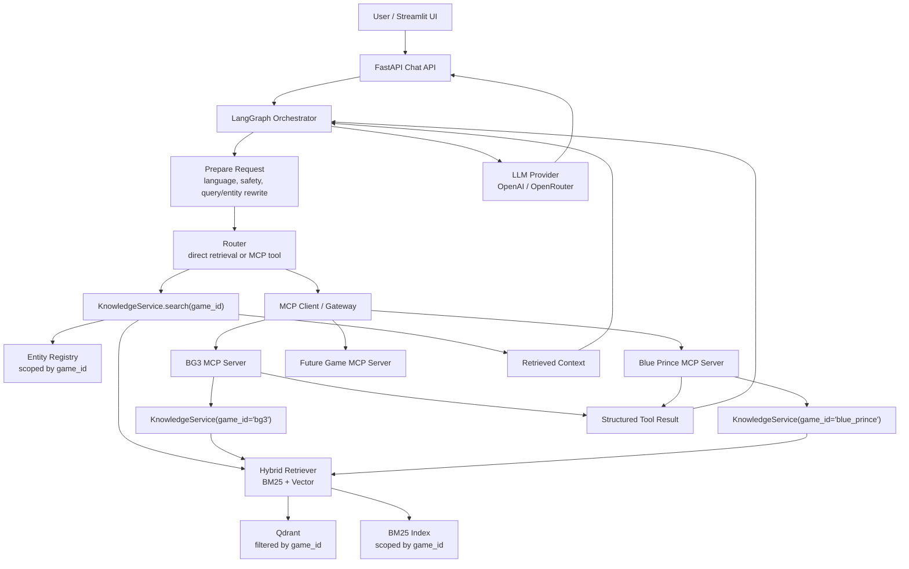
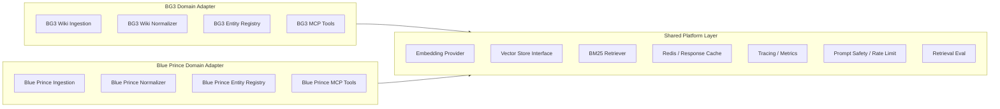
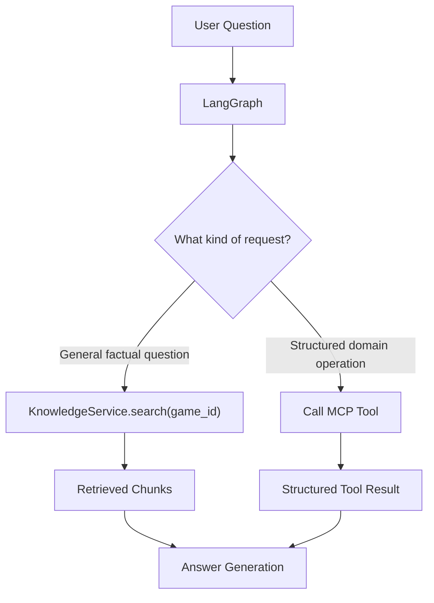

# OmniLibrarian MCP Architecture

This document explains how MCP fits into OmniLibrarian without turning into a workaround around RAG.

## Short Version

MCP does not replace RAG.

RAG is the shared knowledge retrieval engine. MCP is the standardized tool layer that exposes game-specific capabilities to the agent.

The correct split is:

- shared platform: embeddings, vector search, BM25, cache, tracing, safety, rate limits;
- domain adapters: BG3 ingestion, BG3 normalizer, BG3 entity registry, BG3 MCP tools;
- game namespace: every retrieval call is scoped by `game_id`;
- MCP server: exposes domain-specific tools and calls the shared platform only through a scoped service.

## Why MCP Is Not A Separate RAG Database

The system should not create one unrelated RAG stack per MCP server.

Instead, MCP servers should use a shared knowledge backend through a strict game boundary:

```text
BG3 MCP Server -> KnowledgeService(game_id="bg3")
Blue Prince MCP Server -> KnowledgeService(game_id="blue_prince")
```

This lets the platform reuse expensive and complex parts:

- embedding provider;
- Qdrant integration;
- BM25 indexing logic;
- query rewriting;
- tracing;
- caching;
- eval tooling.

But domain-specific logic stays isolated:

- source adapters;
- normalizers;
- entity registries;
- MCP tool definitions;
- structured game actions.

## Target Runtime Shape



## Shared Platform vs Domain Adapter



The shared platform should know how to search, cache, trace, and evaluate.

The domain adapter should know what a spell, companion, class, puzzle, item, or room means for a specific game.

## MCP Tool Responsibilities

MCP tools should be useful when the agent needs structured or domain-specific actions.

Good BG3 MCP tools:

```text
search_bg3_knowledge(query, limit)
get_bg3_entity(name)
compare_bg3_spells(spell_a, spell_b)
list_bg3_companions()
get_bg3_build_advice(class_name, goal)
```

These tools can internally call retrieval, entities, or deterministic local data. The important part is that the agent sees a stable tool contract instead of knowing implementation details.

## Direct RAG vs MCP Tool Call



Examples:

```text
"What damage does Fireball do?"
-> direct RAG search is enough.

"Compare Fireball and Lightning Bolt"
-> MCP tool can provide structured comparison, possibly with RAG support.

"List all companions"
-> MCP tool is better than semantic search.

"Build me a Warlock item setup"
-> MCP tool can combine retrieval with domain heuristics.
```

## Data Isolation Model

For the course project, one Qdrant collection with `game_id` filtering is acceptable:

```text
Qdrant
  collection: omnilibrarian_chunks
    payload.game_id = bg3
    payload.source_id = bg3_wiki

    payload.game_id = blue_prince
    payload.source_id = blue_prince_wiki
```

This is simple and demonstrates tenant isolation clearly.

For production, there are two valid options:

```text
Option A: one collection, strict payload filters
  omnilibrarian_chunks
    game_id = bg3
    game_id = blue_prince

Option B: collection per game or tenant
  bg3_chunks
  blue_prince_chunks
  poe2_chunks
```

Option A is easier for the MVP.

Option B is cleaner when games have very different scale, permissions, lifecycle, or deployment requirements.

## KnowledgeService Boundary

The MCP server should not talk directly to Qdrant.

It should call a scoped service:

```python
class KnowledgeService:
    def search(self, *, game_id: str, query: str, limit: int) -> list[dict]:
        ...

    def get_entity(self, *, game_id: str, name: str) -> dict | None:
        ...
```

Then the BG3 MCP server receives a service already scoped to BG3:

```python
bg3_service = KnowledgeService(game_id="bg3")
```

This prevents the BG3 MCP server from accidentally querying Blue Prince data.

## First BG3 MCP MVP

The first MCP milestone should stay small:

1. Add a local BG3 MCP server package.
2. Add a scoped `KnowledgeService`.
3. Implement `search_bg3_knowledge`.
4. Implement `get_bg3_entity`.
5. Implement `compare_bg3_spells` as a simple structured tool.
6. Add tests for tool outputs and game isolation.
7. Add a LangGraph branch that can call one MCP tool.
8. Add tool call information to trace output.

The goal is not to build many tools. The goal is to prove the architecture.

## Current Local Transport

The local implementation runs each game's MCP server as a separate streamable HTTP service:

```text
BG3 MCP server:         http://127.0.0.1:8765/mcp
Blue Prince MCP server: http://127.0.0.1:8766/mcp

API settings:
BG3_MCP_URL=http://127.0.0.1:8765/mcp
BLUE_PRINCE_MCP_URL=http://127.0.0.1:8766/mcp
```

`scripts/run_dev.py` starts FastAPI, Streamlit, and all configured MCP servers together, but they are still separate processes. FastAPI does not import and call MCP tool functions directly in the normal path. LangGraph calls the game-scoped MCP client through the MCP registry, and the client calls the MCP server over the MCP transport.

This local shape maps cleanly to deployment:

```text
FastAPI container/service -> BG3 MCP container/service -> shared KnowledgeService/retrieval backend
```

For the course project, the local fallback adapter can remain useful for tests, but the demo path should show `transport: mcp_client` in traces.

## Trace Example

For a tool-routed request, trace should eventually look like this:

```json
[
  {"step": "prepare_request", "status": "ok"},
  {"step": "safety_guard", "status": "allowed"},
  {"step": "route_request", "route": "mcp_tool"},
  {"step": "mcp_call", "tool": "compare_bg3_spells", "status": "ok", "transport": "mcp_client"},
  {"step": "generate_answer", "status": "ok"}
]
```

This is important for course presentation because it shows that LangGraph is orchestrating RAG and tools, not just calling a single prompt.

## Tool Routing

The current router uses declarative `ToolSpec` entries instead of hardcoded LangGraph branches.

Each spec describes:

- target `game_id`;
- public MCP tool name;
- intent, such as `comparison` or `list`;
- optional entity type, such as `spell` or `character`;
- trigger phrases for tools that do not depend on named entities;
- argument mapping rules.

Examples:

```text
"Compare Fireball and Lightning Bolt"
-> compare_bg3_spells(spell_a="Fireball", spell_b="Lightning Bolt")

"List all companions"
-> list_bg3_companions(limit=50)
```

This keeps LangGraph focused on orchestration. Adding a new tool should usually mean adding a tool function, registering it in the MCP server, and adding a router spec.

## What Would Be Wrong

Avoid these designs:

- each MCP server has its own unrelated vector search implementation;
- BG3 MCP server can query all games;
- MCP tools duplicate all RAG logic;
- LangGraph contains hardcoded BG3 business logic;
- one universal normalizer tries to parse every website;
- adding a new game requires editing many unrelated files.

## Desired Extension Story

Adding a new game should require:

1. Add source adapter and normalizer.
2. Ingest raw documents.
3. Build chunks and entity registry.
4. Index vectors.
5. Register tenant/game config.
6. Add game-specific MCP tools only where useful.
7. Add eval cases.

The core retrieval, caching, tracing, API, and UI should mostly stay unchanged.

## Course Project Talking Point

The key architecture message:

```text
OmniLibrarian uses RAG as a shared retrieval engine and MCP as a domain-specific tool interface.
MCP servers do not own separate knowledge silos; they call scoped platform services through tenant/game boundaries.
LangGraph decides when to use direct retrieval and when to call a structured tool.
```

This makes MCP feel like a clean extension point rather than a workaround.
